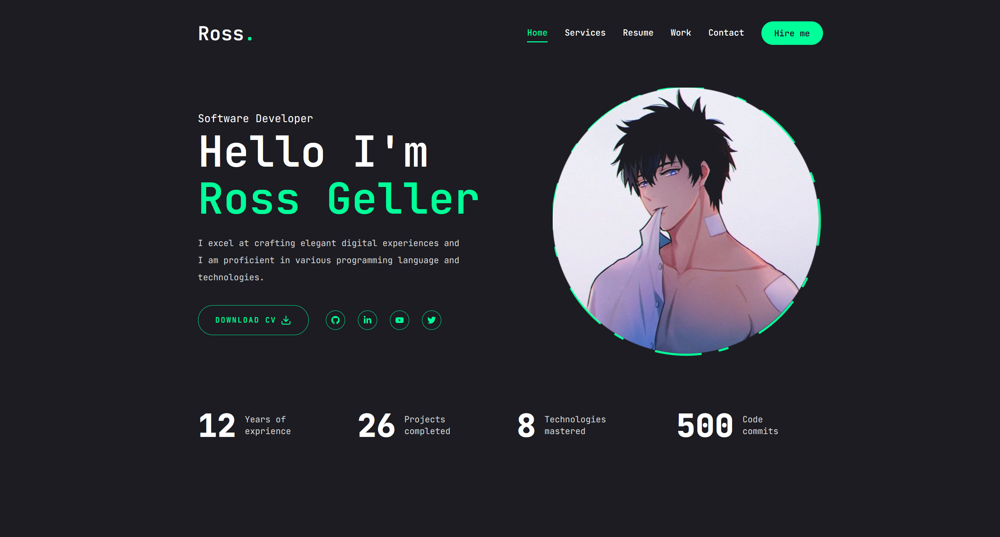

# Personal Portfolio Template ( Next.js, ShadcnUI, TailwindCSS & Framer Motion )

Are you finding it challenging to build a professional portfolio website? Don’t worry! With the Developer Portfolio template, you can effortlessly create a personalized portfolio that suits your style. Designed for ease of use and customization, this template is ideal for both developers and freelancers. Start building your portfolio today!

### Website preview

<p align="center"> 
  <kbd>
    <a href="https://ross-portfolio-template.vercel.app" target="_blank">
  </a>
  </kbd>
</p>

:star: Star me on GitHub — it helps!

## Features 📋

⚡️ Fully Responsive\
⚡️ Next.js, Shadcn/ui, TailwindCSS\
⚡️ Animation using `Framer Motion`\
⚡️ Easy to modify

## Sections :bookmark:

✔️ Home\
✔️ Services\
✔️ Resume \
✔️ Work \
✔️ Contact

## Installation :arrow_down:

#### You will need to download Git and Node to run this project

- [Git](https://git-scm.com/downloads)
- [Node](https://nodejs.org/en/download/)

#### Ensure that your computer has the stable or latest versions of both Git and Node installed.

```bash
node --version
git --version
```

## Getting Started :dart:

#### Fork and Clone the repo

To Fork the repo click on the fork button at the top right of the page. Once the repo is forked open your terminal and perform the following commands

```bash
git clone https://github.com/<YOUR GITHUB USERNAME>/portfolio-template.git

cd portfolio-template
```

#### Install packages from the root directory

```bash
npm install
# or
yarn
```

Then, run the development server:

```bash
npm run dev
# or
yarn dev
```

Open [http://localhost:3000](http://localhost:3000) with your browser to see the result.

## Tools Used 🛠️

- [<b>Shadcn</b>](https://ui.shadcn.com/) - Customizable component library for building modern web apps.
- [<b>Tailwind CSS</b>](https://tailwindcss.com/) - Utility-first CSS framework with predefined classes.
- [<b>Motion</b>](https://motion.dev/) - A modern animation library for JavaScript and React
- [<b>Swiper</b>](https://swiperjs.com/) - The most modern mobile touch slider

## Contributing 💡

#### Step 1

- **Option 1**

  - 🍴 Fork this repo!

- **Option 2**
  - 👯 Clone this repo to your local machine.

#### Step 2

- **Build your code** 🔨🔨🔨

#### Step 3

- 🔃 Create a new pull request.

## License 📄

This project is licensed under the MIT License - see the [LICENSE.md](./LICENSE) file for details.
